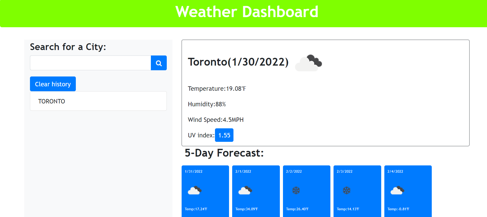
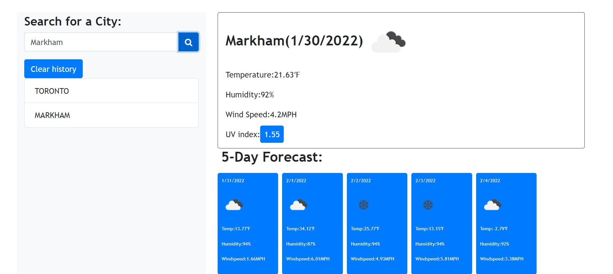

# WeatherDashboard
For this application i created an account on openweather map to generate the API key for the weather data for the cities. (https://openweathermap.org/api)
The for the date format i used MDN web docs (.https://developer.mozilla.org/en-US/docs/Web/JavaScript/Reference/Global_Objects)
When the name of the city is enterd and clicked search button , current weather in that city with temperature,humidity,windspeed and UV index is displayed.
And five days weather forecast for that particular city with temperature,humidity and windspeed is diplayed
A clear history button is added to clear the cities from the search log. If you click on the previously searched city it will show the forecast for that city again.

#Screenshot
 

 The link for the live application is: https://abilalu.github.io/WeatherDashboard/